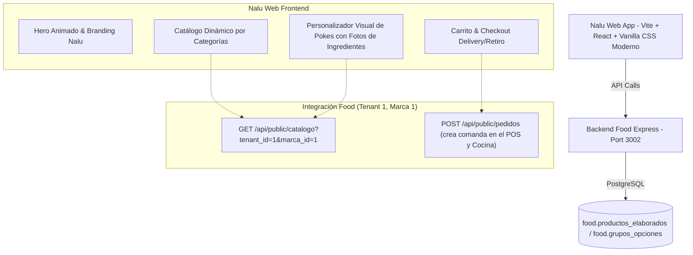

# Plan de Desarrollo: Super Web Pokebowls - NALU POKE 🥗🌊

Este plan maestro define la arquitectura, diseño visual y experiencia de usuario para la nueva plataforma web y móvil de **Nalu Poke**, conectada directamente con el sistema de gestión y pedidos de **Food** (`tenant_id: 1`, `marca_id: 1`).

---

## 1. Análisis de Inspiración y Benchmark Visual

| Sitio de Referencia | Elementos Destacados a Incorporar | Implementación en Nalu Web |
| :--- | :--- | :--- |
| **Eat Poke Bros** (`eatpokebros.com`) | Presentación visual de ingredientes en bandejas frescas y animación de ensamble paso a paso. | Hero interactivo con banner dinámico, bandeja visual de ingredientes y selector por pasos (Base, Proteína, Mix-ins, Salsas, Toppings). |
| **Poke House Menu** (`poke.house/menu`) | Navegación fluida por categorías, efectos con scroll horizontal/vertical sutil y tipografía fresca. | Menú categorizado ("Pokes Clásicos", "Arma tu Poke", "Bebidas", "Postres") con micro-animaciones al hacer scroll y badges llamativos. |
| **Get Poke Bowl** (`getpokebowl.com`) | Transición elegante de fotos de portada. | Slider/crossfade atmosférico y sutil integrado en una sección de storytelling y frescura de producto, sin sobrecargar el Hero. |
| **Poke House Culture** (`poke-house.com/culture`) | Estética californiana-hawaiana, paleta cálida y vibrante (verde menta, salmón fresco, crema, dorado solar). | Paleta de colores premium con modo claro luminoso y toques de naturaleza marina, usando el logo oficial `Logo_nalu-sinfondo.png`. |
| **POS de Food (Caja Registradora)** | Selector de grupos y opciones con fotos individuales de cada ingrediente (arroz, salmón, palta, sésamo, etc.). | **Mix perfecto**: la portada/modal muestra la foto grande del bowl terminado o en preparación, y los selectores tienen las miniaturas reales de cada ingrediente del POS. |

---

## 2. Enfoque Dual (Web Desktop vs. Móvil de Alta Conversión)

### A. Vista Web (Desktop Experience)
- **Hero Inmersivo**: 
  - Logotipo Nalu Poke destacado (`Logo_nalu-sinfondo.png`).
  - Animación de ingredientes frescos y llamado a la acción principal: *"Arma tu Poke"* o *"Explorar la Carta"*.
  - Vista previa interactiva del bowl donde cada ingrediente seleccionado se refleja en tiempo real.
- **Showcase de Bandejas de Ingredientes**:
  - Sección visual que resalta la calidad de la materia prima (pescados frescos, bases nutritivas, aderezos de autor).
- **Menú y Carrito Lateral Flotante**:
  - Navegación rápida por categorías con scroll espía (*scrollspy*).
  - Drawer lateral elegante para revisar pedido, resumen de personalizaciones y cálculo en tiempo real.

### B. Vista Móvil (Mobile App Experience & Pedidos Express)
- **Diseño tipo App Nativa (PWA / Mobile First)**:
  - Barra de navegación inferior fija (*Bottom Bar*): Menú, Arma tu Poke, Mi Pedido (con badge del total), Contacto/Info.
  - Barra de categorías sticky horizontal con scroll táctil suave.
  - Tarjetas de producto optimizadas para pulgar (touch-friendly), con botones de acción directa `+` y fotos destacadas.
  - **Modal "Arma tu Poke" optimizado para móvil**:
    - Flujo estilo "paso a paso" con barra de progreso superior (Paso 1: Base -> Paso 2: Proteína -> Paso 3: Acompañamientos -> Paso 4: Salsas -> Paso 5: Crunch/Topping).
    - Grid de 2 columnas con tarjetas grandes táctiles que muestran la foto del ingrediente, nombre y costo adicional si aplica.
    - Botón flotante inferior: *"Continuar ($340)"* o *"Agregar al Carrito"*.
  - **Checkout Express**:
    - Selección de canal (Delivery / Retiro en Local / Mesa).
    - Formulario de datos simplificado (Nombre, Teléfono, Dirección) y envío de pedido directo al backend con estado `abierto` o `en_cocina`.

---

## 3. Arquitectura Técnica e Integración con Backend Food



### Endpoints en `Food/server`:
1. **`GET /api/public/marcas/1/catalogo`**:
   - Devuelve platos elaborados, bebidas de reventa, grupos de opciones e imágenes de insumos filtrados por `tenant_id=1` y `marca_id=1`.
2. **`POST /api/public/pedidos`**:
   - Permite que los clientes envíen sus pedidos desde la web (Take-Away o Delivery) sin requerir sesión administrativa, ingresando directamente a la cocina y caja registradora de Food.

---

## 4. Estructura del Proyecto `Nalu Web`

```text
Nalu Web/
├── index.html
├── package.json
├── vite.config.ts
├── public/
│   ├── Logo_nalu-sinfondo.png
│   ├── Logo_nalu.PNG
│   └── ... (assets generados de bandejas e ingredientes)
├── src/
│   ├── main.tsx
│   ├── App.tsx
│   ├── index.css (Variables de diseño, tokens, glassmorphism y animaciones)
│   ├── components/
│   │   ├── Navbar.tsx (Adaptable desktop/mobile con logo y carrito)
│   │   ├── HeroSection.tsx (Hero inmersivo con animaciones de bowls e ingredientes)
│   │   ├── FreshIngredientsShowcase.tsx (Presentación tipo bandejas EatPokeBros)
│   │   ├── MenuSection.tsx (Lista categorizada con scroll suave y filtros)
│   │   ├── PokeCustomizerModal.tsx (Personalizador interactivo con fotos del POS)
│   │   ├── StoryCultureSection.tsx (Sección de fotos sutiles inspirada en Poke House)
│   │   ├── CartDrawer.tsx (Resumen y checkout rápido)
│   │   ├── MobileBottomNav.tsx (Navegación tipo App móvil para celulares)
│   │   └── CheckoutModal.tsx (Envío de pedido directo a Food)
│   ├── services/
│   │   └── api.ts (Conexión al backend de Food)
│   └── types/
│       └── food.ts (Tipos de datos de platos, ingredientes y pedido)
```
